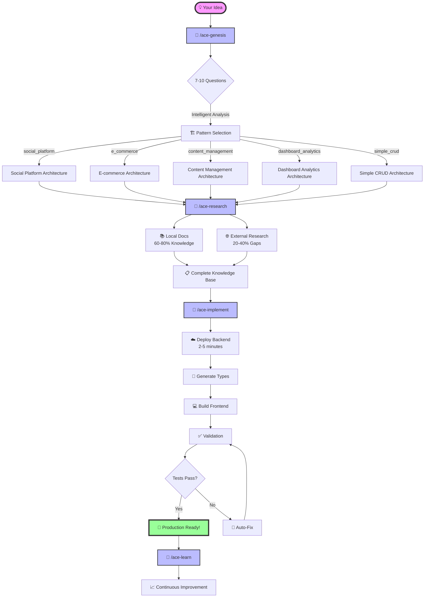

# 🎯 ACE-Flow Visual Command Flow

**Visual guide showing the intelligent workflow progression from idea to production-ready application.**

## 📊 Command Flow Diagram



## 🔄 Simplified ASCII Flow

```
┌─────────────┐     ┌─────────────┐     ┌─────────────┐     ┌─────────────┐
│  💡 IDEA    │ --> │ 🧠 GENESIS  │ --> │ 🔬 RESEARCH │ --> │ 🚀 IMPLEMENT│
└─────────────┘     └─────────────┘     └─────────────┘     └─────────────┘
                           |                     |                     |
                           v                     v                     v
                    7-10 Questions        30-100 Pages         Infrastructure
                    Pattern Match         Local + Web          Types + Frontend
                    Architecture          Knowledge Base       Auto-Validation
                                                                      |
                                                                      v
┌─────────────┐     ┌─────────────┐                          ┌─────────────┐
│ 📈 IMPROVE  │ <-- │ 🧠 LEARN    │ <----------------------- │ 🎉 PRODUCTION│
└─────────────┘     └─────────────┘                          └─────────────┘
```

## ⏱️ Timeline View

```
Time:   0min        5min         25min        45min         90min        95min
        |           |            |            |             |            |
Flow:   [💡]----->[🧠]------->[🔬]-------->[🚀]-------->[🎉]------->[🧠]
        IDEA     GENESIS     RESEARCH    IMPLEMENT    PRODUCTION    LEARN
               Interview    Doc Scrape   Deploy+Code    Validated   Improve
               Analysis     Knowledge    Auto-Test      Working     System
               Pattern      Validation   Auto-Fix       App         Learning
```

## 🏗️ Architecture Pattern Decision Tree

```
                            💡 Your Idea
                                 |
                          🧠 /ace-genesis
                                 |
                    ┌────────────┴────────────┐
                    |                         |
              Multi-User?                Single User?
                    |                         |
           ┌────────┴────────┐               |
           |                 |               v
      Real-time?        E-commerce?    simple_crud
           |                 |
     ┌─────┴─────┐          v
     |           |      e_commerce
  Social?    Analytics?
     |           |
     v           v
social_platform  dashboard_analytics
```

## 📋 Command Details

### 1️⃣ Genesis Phase (2-5 minutes)
```bash
/ace-genesis "your amazing idea"
```
- **Input**: Natural language description
- **Process**: Intelligent interview
- **Output**: Architecture decision + PRP

### 2️⃣ Research Phase (15-30 minutes, automatic)
```bash
/ace-research [project_name] [pattern]
```
- **Input**: Project context + pattern
- **Process**: Documentation mining
- **Output**: Comprehensive knowledge base

### 3️⃣ Implementation Phase (60-90 minutes)
```bash
/ace-implement [project_name]
```
- **Input**: Research knowledge base
- **Process**: Infrastructure-aware coding
- **Output**: Production-ready application

### 4️⃣ Learning Phase (Continuous)
```bash
/ace-learn analyze
```
- **Input**: Error patterns + solutions
- **Process**: Pattern analysis
- **Output**: System improvements

## 🔄 Migration Flow (Existing Projects)

```
┌──────────────┐     ┌──────────────┐     ┌──────────────┐
│ Existing App │ --> │  /ace-adopt  │ --> │ Safe Branch  │
└──────────────┘     └──────────────┘     └──────────────┘
                            |                      |
                            v                      v
                     Test Generation         Incremental
                     Backup Creation         Migration
                     Safety Checks           Validation
                            |                      |
                            v                      v
                     ┌──────────────┐     ┌──────────────┐
                     │ ACE-Enhanced │ <-- │ Zero Downtime│
                     │     App       │     │   Upgrade    │
                     └──────────────┘     └──────────────┘
```

## 📊 Success Metrics Flow

```
Input Quality          Process Quality         Output Quality
     |                      |                      |
     v                      v                      v
┌─────────┐           ┌─────────┐           ┌─────────┐
│ Genesis │           │Research │           │Implement│
│  >95%   │           │ 30-100  │           │  >95%   │
│ Pattern │           │  Pages  │           │ First   │
│  Match  │           │Analyzed │           │  Run    │
└─────────┘           └─────────┘           └─────────┘
     |                      |                      |
     └──────────────────────┴──────────────────────┘
                            |
                            v
                    ┌─────────────┐
                    │ Production  │
                    │   Ready     │
                    │  <2 Hours   │
                    └─────────────┘
```

## 🎯 Key Benefits Visualization

```
Traditional Development          ACE-Flow Development
        |                               |
        v                               v
   [6-8 weeks]                    [<2 hours]
        |                               |
   ┌────┴────┐                    ┌────┴────┐
   │ Manual  │                    │  Auto   │
   │ Setup   │                    │ Genesis │
   │Research │                    │Research │
   │ Coding  │                    │Implement│
   │ Testing │                    │ Deploy  │
   │ Deploy  │                    │Validate │
   └─────────┘                    └─────────┘
        |                               |
   Maybe Works?                   Works First Time!
```

---

*Last Updated: 2025-07-20*
*Visual Guide Version: 1.0*